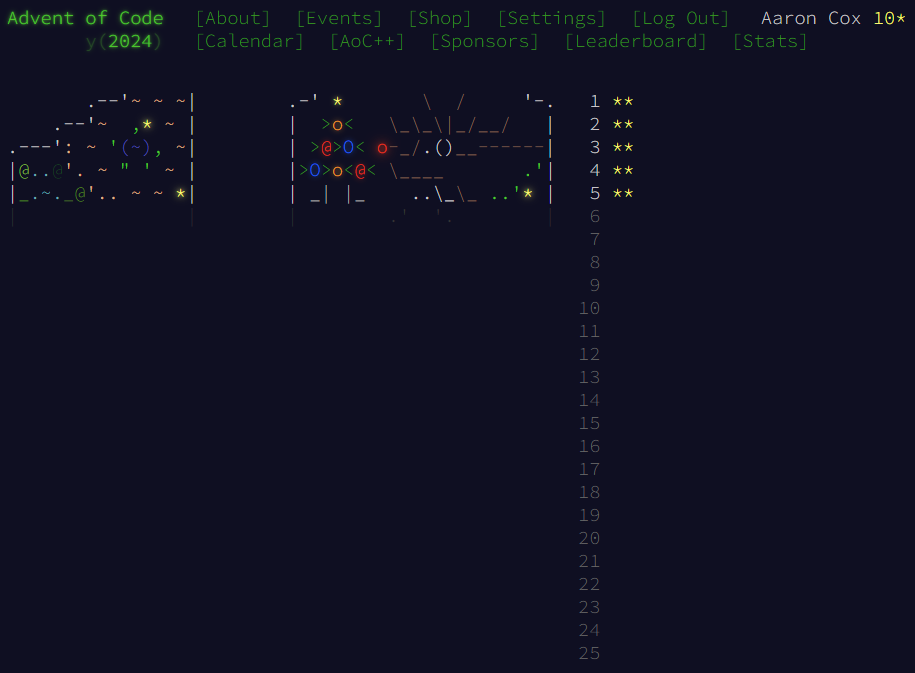
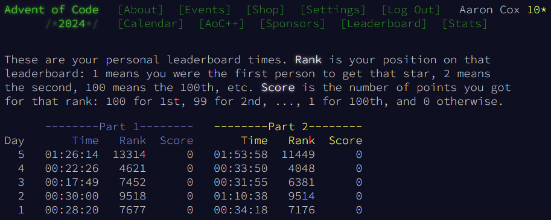

# Advent of Code - 2024
This year I'll be completing the advent of code challenges using typescript and Deno.
Each day's challenges is progressavelly more difficult than the last

The advent of code challenges are created by Eric Wastl - learn more: https://adventofcode.com/2024/about

My code each day's challgnge solution - `part 1` and and `part 2` can be found in at:

-  `./src/challgnes/${day}/part1.ts
-  `./src/challgnes/${day}/part1.ts

My solutions can run within the browser, some even have visualisations  
TODO: Insert Link

I'll update my progress on each days's completion via screenshots below.

## Completion

## Personal Times
